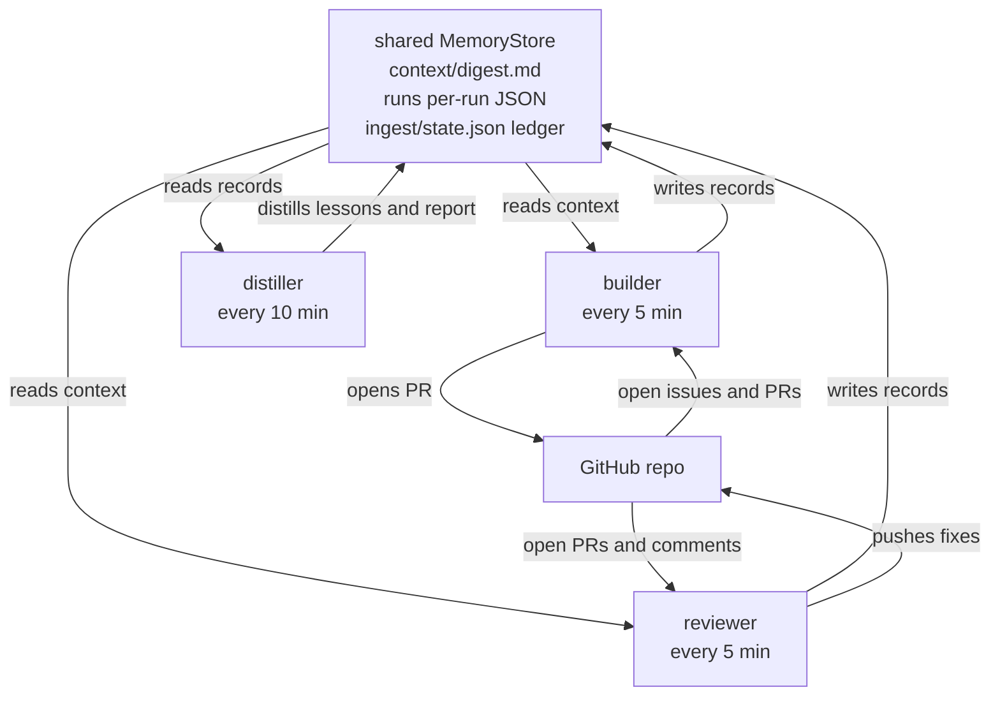

# Architecture

`flyte-agent-loop` is a **loop-engineering** system: three scheduled Flyte 2
agent pipelines that cooperate over a shared, durable memory to autonomously move
GitHub issues to merged code.



## Pipelines

Each pipeline is a single `@env.task(report=True, triggers=[...])` on one shared
`flyte.TaskEnvironment` (`environments.py`). The cron cadence is set via
`flyte.Trigger(name=..., automation=flyte.Cron("*/N * * * *"))`.

### 1. `builder` — every 5 minutes (`builder_agent.py`)

1. **Dibs.** List open issues; skip any that already have an associated open PR,
   then for the first one with no active claim post a dibs marker comment
   (`try_claim`). Concurrent/future runs see the marker and skip it until it
   expires (`FLYTE_AGENT_DIBS_TTL_MINUTES`) or is released.
2. **Build.** A `flyte.ai.agents.Agent` (read GitHub tools + the shared context
   digest) implements the change scoped to what the issue asks for, **staging each
   file via a `stage_file` tool** rather than returning one giant JSON blob (see
   *File staging* below).
3. **Verify.** A stricter verifier sub-agent checks the plan for correctness and
   completeness, returning a structured `{"verified": bool, "notes": ...}`.
4. **Create PR.** Only if verified, the pipeline opens a PR
   (`open_pr_with_changes`, a durable tool task). If not verified, it posts the
   verifier feedback to the issue and releases the claim for a retry.
5. **Record.** Append a `RunRecord` to shared memory.

### 2. `reviewer` — every 5 minutes (`reviewer_agent.py`)

1. **Dibs.** Find open PRs authored by the agent's GitHub user; claim the first
   unclaimed one so prior/parallel runs know it's being worked.
2. **Read comments.** A reviewer agent reads the PR and *all* its comments.
3. **Fix.** It designs tightly-scoped fixes as a JSON plan.
4. **Verify.** The verifier confirms the fixes are **aligned with the comments
   AND correct**.
5. **Update + release.** Only if verified, push the fixes to the PR head branch
   (`push_changes_to_pr`) and **release the dibs** so a later run can pick up any
   additional follow-up comments.
6. **Record.** Append a `RunRecord`.

### 3. `distiller` — every 10 minutes (`distiller_agent.py`)

The distiller reads the builder's and reviewer's run history and uses a **distiller
Agent** (`build_distiller_agent`) to fold it into a compact, high-signal memory —
so the MemoryStore carries as much useful signal as possible per token. The steps
are wrapped with the decorator that fits their compute needs: `_load_records`,
`_ingest`, `_evaluate` are **`@flyte.trace`** (light memory I/O + pure computation,
in-process); `_snapshot_memory` and `_introspect_runs` are **`@env.task`** (reads
that grow unbounded with history and have no report side-effects, isolated with
their own retries/resources).

1. `_load_records` — load every `RunRecord` **with its unique memory-path id**.
2. `_ingest` — **fold only new records** into the ledger, **only if there is
   something new**. `select_new_records` filters out ids already processed; if none
   remain it returns no new records and shared memory is left untouched. Otherwise
   `ingest_new_records` updates the per-target (`issue:<n>` / `pr:<n>`) rollup and
   saves `ingest/state.json`. Idempotent — already-ingested issues/PRs never
   re-trigger.
3. `_evaluate` — compute success/verification/error rates over the full history (a
   fresh aggregate, pure).
4. **Distill (Agent).** When there are new records, the distiller Agent is run with
   the **prior lessons** (`context/lessons.md`) + the **new records** (rendered
   one-line, verifier-notes-first) + headline metrics, and asked to **dedupe,
   consolidate, and keep the highest-signal lessons** in as few tokens as possible.
   Its output replaces `context/lessons.md`; the full `context/digest.md` that the
   builder/reviewer read is then `lessons + the deterministic "already processed"
   rollup`. No new records ⇒ no Agent call, no token spend, memory untouched.
5. Publish: a **Metrics** report tab (`render_report_html`), a **Memory Store** tab
   (`_snapshot_memory` renders the whole memory filesystem — every file + truncated
   contents, grouped by store), and a **Run Traces** tab (`_introspect_runs`). Each
   `RunRecord` carries its Flyte `run_name`; `introspect.trace_runs` uses
   `flyte.remote.Action.listall(for_run_name=…)` + `action.details()` to read every
   durable sub-action of a run (the tool/PR/commit actions) with its metadata +
   truncated I/O — the flat "reasoning trace". Best-effort: a remote-API hiccup
   produces an error row, never a crash.

**Why an Agent, and why two memory files?** A deterministic compaction can't
recognize that two verifier notes make the same point, or that a recurring failure
matters more than a one-off — an LLM can, which is what "most signal per token"
needs. Splitting `lessons.md` (the Agent's consolidated output, fed back to it for
incremental consolidation) from `digest.md` (what the agents read = lessons + the
factual "already processed" rollup) keeps the Agent focused on lessons while the
"do not re-litigate" state stays deterministic and un-hallucinable. And because the
Agent only runs on genuinely new records, distillation is incremental — it never
re-summarizes already-seen runs.

## File staging (why not one JSON blob)

The builder/reviewer agents produce a change as a set of full file contents. Early
versions had the agent emit everything as a single JSON object in its final
message — but for any non-trivial change that output exceeds the model's max output
tokens (litellm defaults to only 4096!) and gets truncated into invalid JSON,
silently dropping the run into `no_work` (no verify, no PR).

Instead (`staging.py`), the agent calls **`stage_file(path, content)` once per
file**, then `submit_implementation(...)` / `submit_fix(...)`. These are *plain
closure tools* — the harness invokes them **in-process** (unlike `@env.task`
tools, which dispatch as separate actions), so they accumulate into a
`ChangeStage` the pipeline owns. With `parallel_tool_calls=False`, staging is
sequential: each turn's output is bounded by the largest single file (not the sum),
and the shared state mutates race-free. After the run the pipeline reads
`stage.to_plan()` directly — no free-text parsing to truncate. The LLM callback
(`llm.py`) also sets a generous `max_tokens` (clamped to the model max) as a second
layer of defense.

## Dibs (cooperative locking)

Implemented in `dibs.py` as a pure state machine over comment markers — an
invisible HTML comment:

```
<!-- flyte-agent-loop:dibs v1 op=claim kind=issue agent=<id> run=<run> until=<iso8601> -->
```

`active_claim` walks the markers for a kind (issue/pr); the latest one wins. A
`release` marker or an expired `until` frees the target. Claims are re-entrant
for their owning agent. Because the logic is pure (comments + an explicit `now`),
it is fully unit tested without any network.

## Shared memory

**Two** keyed `flyte.ai.agents.MemoryStore` s with disjoint writer sets
(`memory_context.py`):

- `<key>-runs` — one file per run at `runs/<ts>_<run>.json`. Written by pipelines
  1 & 2 (each to a unique path), read by pipeline 3.
- `<key>-context` — `context/digest.md` + `ingest/state.json`. Written only by
  pipeline 3, read by pipelines 1 & 2.

The split matters: `MemoryStore.save()` uploads the whole local root and only
re-hydrates from remote for *deserialized* stores, so a `get_or_create` store
re-uploads the snapshot it downloaded at open time. If run records and the
digest/ledger shared one store, a pipeline-1/2 `record_run().save()` could
overwrite a newer digest/ledger written concurrently by pipeline 3 — reverting
the ingestion state. With two stores, `-runs` writers only ever touch unique
paths (identical re-uploads are no-ops) and `-context` has a single writer.

## Known limitations / trade-offs

These are deliberate simplifications for a minimal system, called out so they are
not mistaken for guarantees:

- **Dibs is best-effort, not a mutex.** Two runs that read an unclaimed
  issue/PR in the same instant can both post a claim (a TOCTOU window). The TTL
  + agent id make the collision visible and self-healing; they don't prevent it.
- **Pipeline 3 overlap.** `distiller` is not itself protected by dibs. If one run
  exceeds its 10-minute cadence, an overlapping run can last-writer-win on the
  `-context` store. Ingestion is id-keyed so records aren't double-counted within
  a run, but a lost `state.json` update would let the next run re-ingest.
- **First page only.** The client fetches one page of issues/PRs/comments
  (50/100). A dibs marker beyond 100 comments won't be seen (→ possible re-claim).
- **Unbounded growth.** `runs/` files and `processed_record_ids` accumulate; a
  compaction/retention step would be needed for long-lived deployments.
- **Blocking I/O.** The GitHub client is synchronous `httpx`; calls block the
  task's event loop. Fine for these single-flight tasks, not for high fan-out.
- **GitHub retry vs. hard egress.** The client retries transient failures
  (connect/read timeouts, 5xx, 429) with exponential backoff
  (`FLYTE_AGENT_HTTP_RETRIES`, `FLYTE_AGENT_HTTP_TIMEOUT`), so a *flaky* connection
  to `api.github.com` recovers. But if the task pod has **no egress** to GitHub
  (a common devbox/firewall situation — object storage can be reachable while
  `api.github.com` is not), every attempt times out; retries just delay the
  inevitable `error` RunRecord. That's an infra fix (allow egress to
  `api.github.com`), not a code one. Tasks themselves run with `retries=0`; a
  pipeline that errors still degrades gracefully (releases dibs, records `error`).

## Stages & error recovery

Each pipeline task chunks its work into named stages via `flyte.group(...)`
(`claim` → `build`/`review` → `verify` → `open_pr`/`push`, and `distill` for the
distiller). Every agent run and tool sub-action
dispatched inside a stage is grouped under that name in the Flyte UI, so a run's
timeline reads as discrete phases rather than a flat list of actions.

The whole flow is wrapped in a top-level `try/except`. On any runtime error
(a GitHub 4xx/5xx, an agent failure, a bad tool call) the pipeline: logs it,
surfaces it in the report, **releases the dibs** on the claimed issue/PR so a
later run can retry, and returns an `error` RunRecord. Persisting the record and
flushing the report are themselves best-effort, so a memory/report hiccup can't
turn a completed run into a task crash. Net effect: a single bad run degrades to
a recorded error instead of a hard failure, and the loop keeps going.

## Testing strategy

All non-trivial logic is isolated into pure, hermetic modules so it can be tested
without a cluster, a network, or an LLM:

- `dibs.py` — claim state machine (`tests/test_dibs.py`)
- `evals.py` — metrics + context compaction (`tests/test_evals.py`)
- `agents.py` — plan/verdict parsers (`tests/test_agents.py`)
- `github_client.py` — exercised against an in-memory `httpx.MockTransport`
  (`tests/test_github_client.py`)

The Flyte task wrappers (`tools.py`, the pipelines) are thin orchestration over
these tested units.
